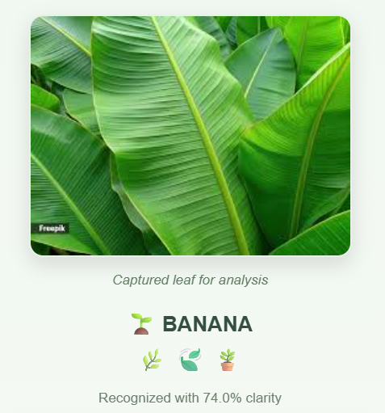
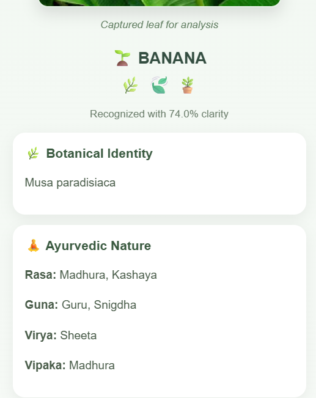

# Ayurvedic-Plant-Identification-System-using-DeepLearning
<<<<<<< HEAD
# 🌿 AyurLeaf — Ayurvedic Plant Identification & Medicinal Knowledge System

> **Recognize a plant. Discover its Ayurvedic wisdom.**

**AyurLeaf** is an AI-powered Ayurvedic plant identification system that combines **Computer Vision, Deep Learning, Flask, MongoDB, and a responsive web interface** to identify medicinal plants from leaf images and provide their corresponding Ayurvedic and medicinal information.

The system allows users to **capture or upload a leaf image**, analyze it using a trained **YOLO-based object detection model**, and instantly receive the predicted plant name along with its **scientific name, Ayurvedic properties, medicinal uses, and traditional knowledge**.

---

## 🌱 About the Project

Traditional knowledge about medicinal plants has been passed down through generations, but identifying plants accurately can be challenging for people who are unfamiliar with their physical characteristics.

**AyurLeaf** was developed to bridge this gap by combining modern Artificial Intelligence with traditional Ayurvedic knowledge.

The application provides a simple workflow:

**Leaf Image → AI Detection → Plant Identification → Ayurvedic Information**

Instead of requiring users to recognize a plant manually, AyurLeaf allows them to simply provide an image of its leaf. The trained deep-learning model analyzes the image and identifies the plant based on learned visual characteristics.

The identified plant is then mapped to a curated database containing its Ayurvedic profile and medicinal information.

---

## ✨ Key Features

### 🔍 AI-Based Plant Identification

Uses a trained **YOLO-based deep learning model** to identify medicinal plants from leaf images.

### 📷 Capture or Upload Leaf Images

Users can either:

* Capture a leaf image using their device camera
* Upload an existing image

### 🌿 Ayurvedic Knowledge

After identification, the system displays important Ayurvedic properties such as:

* **Rasa** — Taste
* **Guna** — Qualities
* **Virya** — Potency
* **Vipaka** — Post-digestive effect

### 💊 Medicinal Uses

Provides the documented medicinal applications associated with the identified plant.

### 📚 Scientific Information

Displays the scientific name of the recognized plant along with its common identification.

### 📱 Mobile-Friendly Interaction

The application can be accessed from a mobile device connected to the same local network, allowing the phone camera to be used for real-time image capture.

### ⚡ Fast Prediction

The trained model is optimized to provide plant identification with low prediction latency.

### 🗄️ MongoDB Integration

Plant information and Ayurvedic knowledge are stored and retrieved using **MongoDB**.

---

# 🖥️ Application Preview

## 🏠 Landing Page

The landing page introduces AyurLeaf and provides users with an intuitive entry point to begin plant identification.

<p align="center">
  
</p>

---

## 📷 Leaf Image Capture & Upload

Users can capture a leaf directly using their device camera or upload an existing image for analysis.

<p align="center">
  
</p>

---

## 🔬 AI-Based Plant Detection

The uploaded leaf image is processed by the trained YOLO model to identify the most probable plant.

<p align="center">
  
</p>

---

## 🌿 Plant Identification Result

Once the prediction is complete, AyurLeaf presents the recognized plant together with its confidence score and scientific information.

<p align="center">
  
</p>

---

## 🪷 Ayurvedic Profile

The system provides the Ayurvedic characteristics of the identified plant, including **Rasa, Guna, Virya, and Vipaka**.

<p align="center">
  
</p>

---

## 💚 Medicinal Uses & Ayurvedic Information

Users can explore the documented medicinal uses and additional Ayurvedic knowledge associated with the recognized plant.

<p align="center">
  
</p>

---

# 🧠 Artificial Intelligence Model

AyurLeaf uses a **YOLO-based object detection model** trained specifically for medicinal plant identification.

The model learns visual characteristics from leaf images and predicts the corresponding plant class when a new image is provided.

### 🌿 Supported Plant Classes

The current system recognizes **9 plant species**:

| No. | Plant     |
| --: | --------- |
|   1 | 🍌 Banana |
|   2 | 🥭 Mango  |
|   3 | 🍈 Papaya |
|   4 | 🌳 Guava  |
|   5 | ☕ Coffee  |
|   6 | 🍋 Lemon  |
|   7 | 🫐 Jamun  |
|   8 | 🧄 Garlic |
|   9 | 🍈 Chikoo |

> The dataset and model can be extended in the future to support additional medicinal plants.

---

# 📊 Model Performance

The trained model achieved strong performance during evaluation.

| Metric                         |      Result |
| ------------------------------ | ----------: |
| **mAP@0.5**                    |   **92.0%** |
| **Processing Speed**           | **~28 FPS** |
| **Average Prediction Latency** | **~120 ms** |
| **Inference Environment**      |         CPU |

These results demonstrate that the system can provide practical plant identification while maintaining a responsive user experience.

---

# 🏗️ System Architecture

The overall system follows a simple AI-powered pipeline:

```text
                    ┌──────────────────────┐
                    │       User           │
                    └──────────┬───────────┘
                               │
                               ▼
                    ┌──────────────────────┐
                    │ Capture / Upload     │
                    │    Leaf Image        │
                    └──────────┬───────────┘
                               │
                               ▼
                    ┌──────────────────────┐
                    │      Flask API       │
                    │     /predict         │
                    └──────────┬───────────┘
                               │
                               ▼
                    ┌──────────────────────┐
                    │   YOLO Deep Learning │
                    │        Model         │
                    └──────────┬───────────┘
                               │
                               ▼
                    ┌──────────────────────┐
                    │   Plant Prediction   │
                    │ + Confidence Score   │
                    └──────────┬───────────┘
                               │
                               ▼
                    ┌──────────────────────┐
                    │      MongoDB         │
                    │ Ayurvedic Knowledge  │
                    └──────────┬───────────┘
                               │
                               ▼
                    ┌──────────────────────┐
                    │  Plant Information   │
                    │ Ayurvedic Properties │
                    │   Medicinal Uses     │
                    └──────────────────────┘
```

---

# 🛠️ Technology Stack

### Frontend

* HTML5
* CSS3
* JavaScript

### Backend

* Python
* Flask
* Flask-CORS

### Artificial Intelligence

* YOLO
* Ultralytics
* Computer Vision
* Deep Learning

### Database

* MongoDB
* PyMongo

### Development Environment

* Python
* Visual Studio Code
* Git & GitHub

---

# 🔄 How AyurLeaf Works

### 1️⃣ Image Acquisition

The user captures or uploads an image of a plant leaf through the web interface.

### 2️⃣ Image Submission

The image is sent to the Flask backend through the `/predict` API endpoint.

### 3️⃣ AI Prediction

The trained YOLO model processes the image and identifies the most likely plant class.

### 4️⃣ Confidence Evaluation

The model returns the predicted plant along with its confidence score.

### 5️⃣ Knowledge Retrieval

The predicted plant name is used to retrieve its corresponding information from MongoDB.

### 6️⃣ Result Presentation

The application displays:

* Plant name
* Scientific name
* Confidence score
* Rasa
* Guna
* Virya
* Vipaka
* Medicinal uses
* Additional Ayurvedic information

---

# 🗄️ Database Design

MongoDB is used to store the Ayurvedic information associated with each recognized plant.

A typical plant record contains information such as:

```text
Plant
│
├── Common Name
├── Scientific Name
│
├── Ayurvedic Profile
│   ├── Rasa
│   ├── Guna
│   ├── Virya
│   └── Vipaka
│
└── Medicinal Uses
```

This separation between **AI prediction** and **knowledge retrieval** makes the system easier to maintain and extend.

---

# 📱 Local Network Camera Support

One of the practical features of AyurLeaf is the ability to use a mobile device as the image-capturing interface.

When the Flask application is hosted on a computer connected to a local network, a mobile device connected to the same network can access the application and capture leaf images using its camera.

```text
Mobile Device
      │
      │  Leaf Image
      ▼
 Local Wi-Fi Network
      │
      ▼
Computer Running Flask
      │
      ▼
YOLO Model
      │
      ▼
Plant Identification
```

This makes the system convenient for collecting leaf images directly in outdoor or field environments.

---

# 📁 Project Structure

```text
AyurLeaf/
│
├── app.py
│
├── best.pt
│
├── templates/
│   └── index.html
│
├── static/
│   ├── css/
│   ├── js/
│   │   └── script.js
│   └── Images/
│
├── Images/
│   ├── landing_page.png
│   ├── capture_leaf.png
│   ├── upload_leaf.png
│   ├── prediction.png
│   ├── result.png
│   ├── ayurvedic_profile.png
│   └── medicinal_uses.png
│
├── requirements.txt
│
└── README.md
```

---

# ⚙️ Installation & Setup

## 1. Clone the Repository

```bash
git clone https://github.com/Nikshitha-git/AyurLeaf.git
```

```bash
cd AyurLeaf
```

## 2. Create a Virtual Environment

```bash
python -m venv venv
```

### Windows

```bash
venv\Scripts\activate
```

## 3. Install Dependencies

```bash
pip install -r requirements.txt
```

## 4. Configure MongoDB

Make sure MongoDB is running and configure the database connection in the Flask application.

For security, sensitive credentials should be stored using environment variables rather than directly inside the source code.

## 5. Start the Flask Application

```bash
python app.py
```

The application will be available through the local Flask server.

---

# 🔐 Security Note

For public deployment, sensitive configuration values such as:

* MongoDB credentials
* Database connection strings
* API keys
* Secret keys

should **not** be committed to GitHub.

Use a `.env` file and add it to `.gitignore`.

Example:

```text
.env
venv/
__pycache__/
*.pyc
```

---

# 🚀 Future Enhancements

AyurLeaf can be further developed into a more comprehensive digital platform for medicinal plant recognition.

### 🌿 More Plant Species

Expand the dataset and model to recognize a larger number of Ayurvedic and medicinal plants.

### 📍 Geolocation-Based Plant Discovery

Integrate location services to identify commonly occurring medicinal plants in a particular region.

### 📷 Real-Time Camera Detection

Enable continuous camera-based detection instead of processing individual uploaded images.

### 🌐 Cloud Deployment

Deploy the application to a cloud platform so that it can be accessed remotely without requiring a local network.

### 🧠 Improved Model Accuracy

Train the model with larger and more diverse datasets covering different lighting conditions, leaf orientations, backgrounds, and growth stages.

### 📖 Expanded Ayurvedic Knowledge Base

Include additional traditional information, preparation methods, precautions, and references from reliable Ayurvedic sources.

### 👤 User Accounts & History

Allow users to create accounts and maintain a history of previously identified plants.

---

# 🎯 Applications

AyurLeaf can potentially be useful in:

* 🌿 Ayurvedic education
* 🎓 Academic and student projects
* 🔬 Medicinal plant research
* 🌱 Botanical learning
* 📚 Traditional knowledge documentation
* 🧑‍🌾 Preliminary plant identification
* 📱 Educational mobile applications

> **Note:** AyurLeaf is intended for plant identification and educational purposes. The medicinal information presented by the system should not be treated as a substitute for professional medical or Ayurvedic advice.

---

# 👩‍💻 Project Information

**Project:** AyurLeaf — Ayurvedic Plant Identification & Medicinal Knowledge System

**Domain:** Artificial Intelligence & Machine Learning

**Technologies:** Python, Flask, YOLO, MongoDB, HTML, CSS, JavaScript

**Project Type:** Major Academic Project

---

# 👩‍💻 Developed By

**Nikshitha Varkala**

B.Tech — Computer Science and Engineering

KMIT, Hyderabad

---

# ⭐ Acknowledgements

This project was developed as an academic initiative to explore the application of **Artificial Intelligence and Computer Vision in the identification of medicinal plants**, while presenting associated traditional Ayurvedic knowledge through a user-friendly digital platform.

---

## 🌿 Bringing Artificial Intelligence Closer to Nature

**AyurLeaf connects modern Computer Vision with the timeless knowledge of Ayurveda — making plant identification simpler, faster, and more accessible.**

⭐ If you find this project interesting, consider giving the repository a star!
=======
# Ayurvedic-Plant-Identification-System-using-DeepLearning
>>>>>>> ca39b3a0193fe6e2ea0c8106b9ca9bf2d4014530
